# Training Diet App

A focused fitness app for managing **workouts, templates, exercises, diet history, calories and body measurements**.
Built with **Next.js App Router**, **Supabase** and a modern UI (shadcn/ui + Tailwind).

---

## 📸 Demo

### Workout — template & create & edit

▶ **[Click to watch video](https://github.com/Marcin-Kowalczykk/Training-diet-app/releases/download/demo-assets/workout-demo.-.COMPRESS.mp4)**

<a href="https://github.com/Marcin-Kowalczykk/Training-diet-app/releases/download/demo-assets/workout-demo.-.COMPRESS.mp4">
  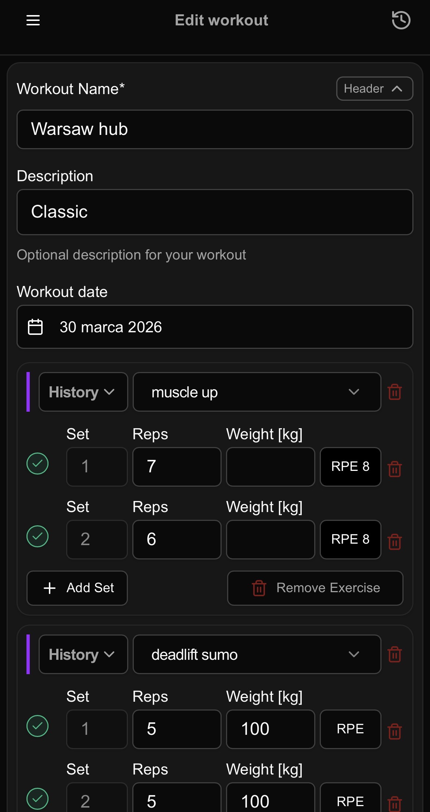
</a>

### Diet — add diet day

▶ **[Click to watch video](https://github.com/Marcin-Kowalczykk/Training-diet-app/releases/download/demo-assets/diet-demo.-.COMPRESS.mp4)**

<a href="https://github.com/Marcin-Kowalczykk/Training-diet-app/releases/download/demo-assets/diet-demo.-.COMPRESS.mp4">
  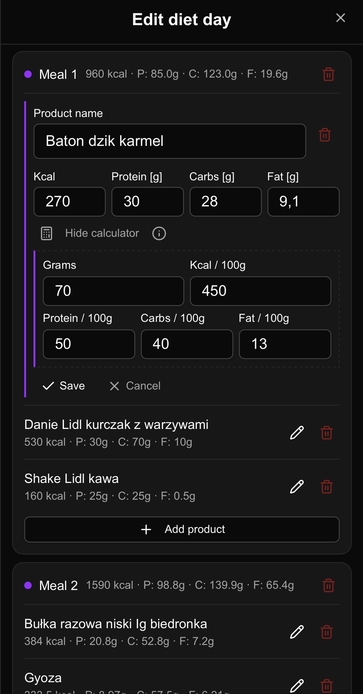
</a>

### Screenshots

<p align="center">
  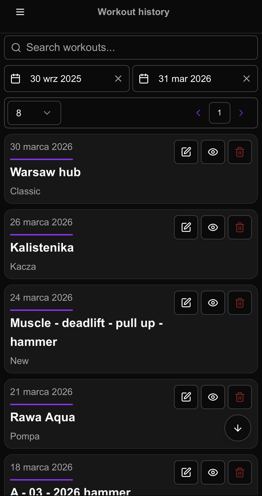
  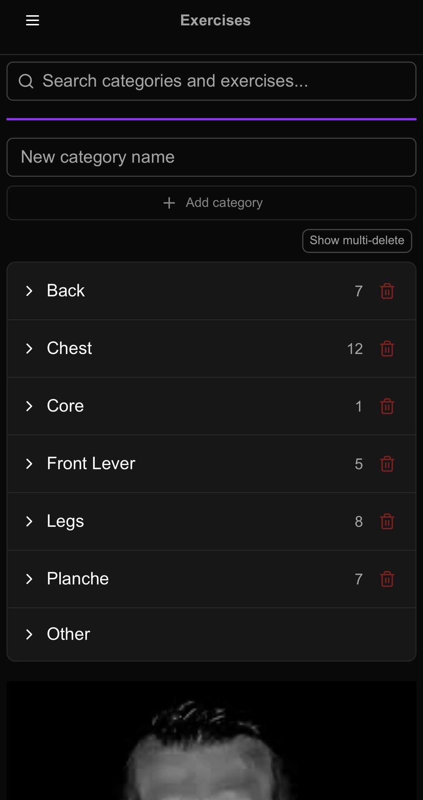
  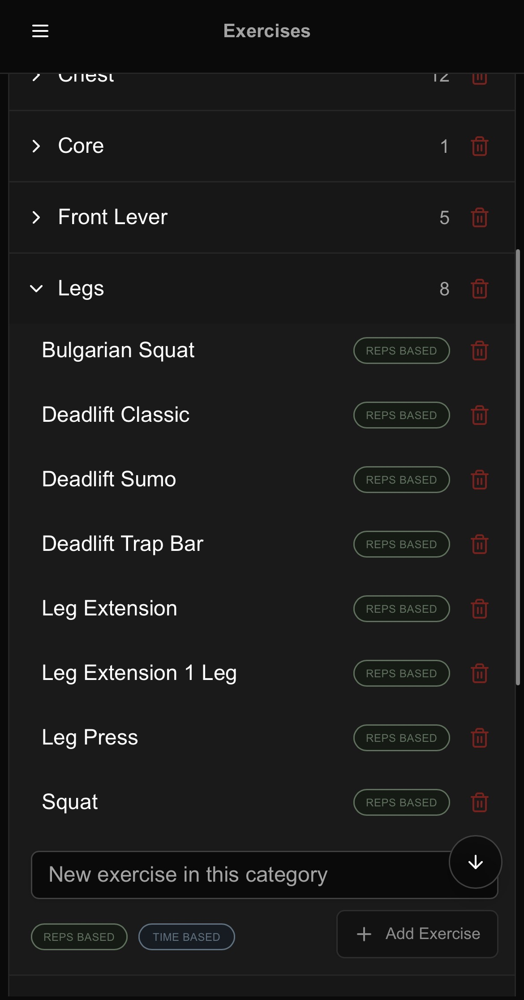
</p>

<p align="center">
  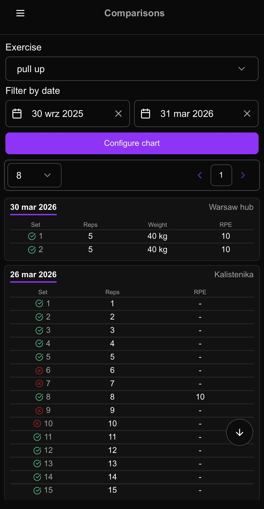
  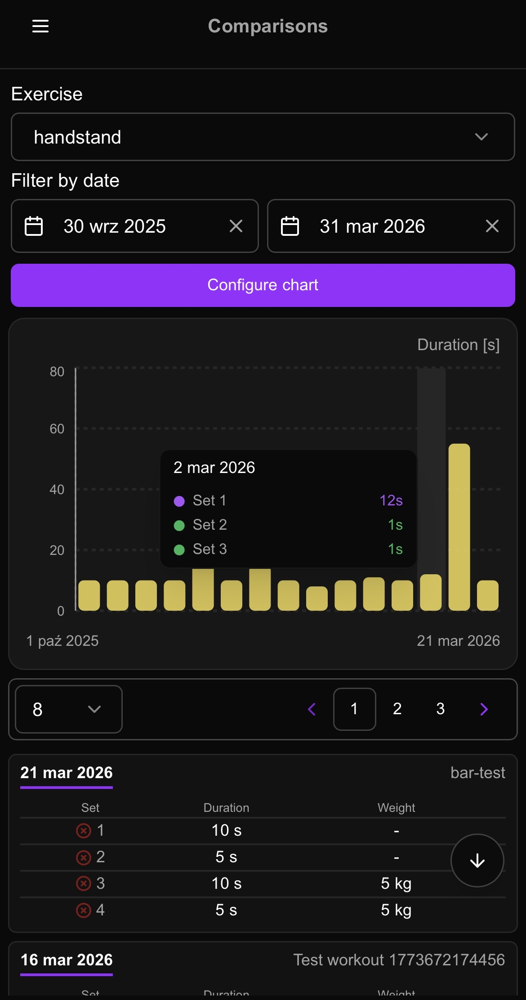
  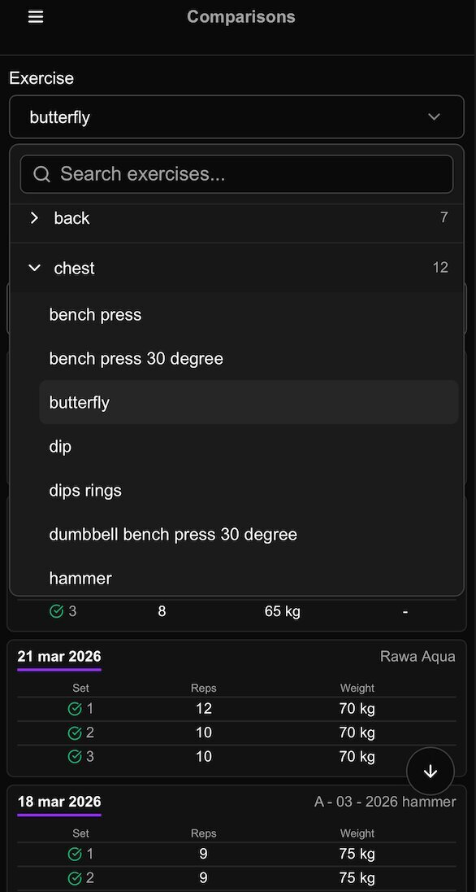
</p>

<p align="center">
  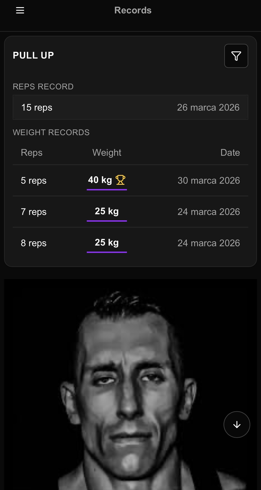
  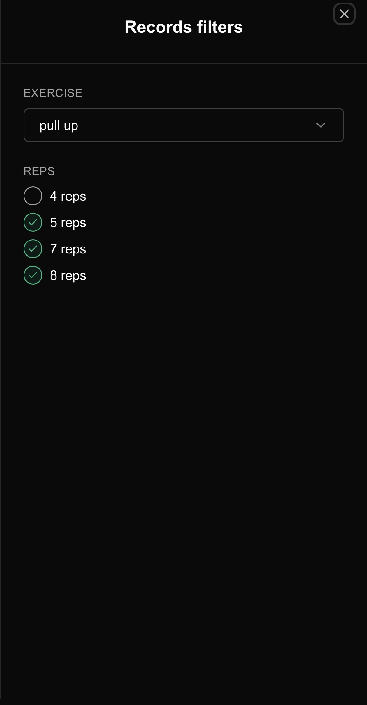
  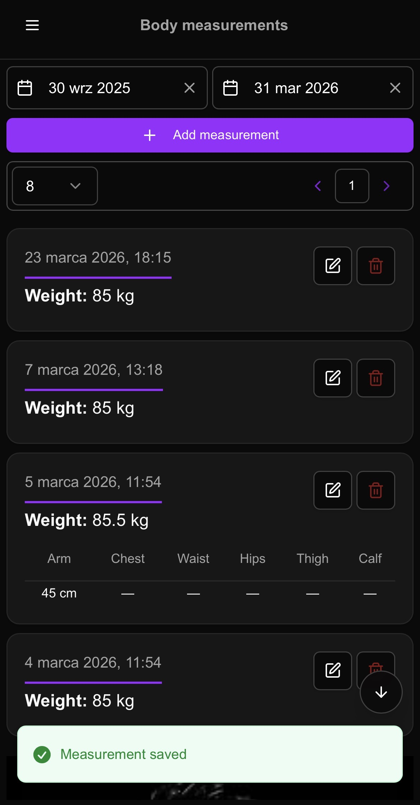
</p>

<p align="center">
  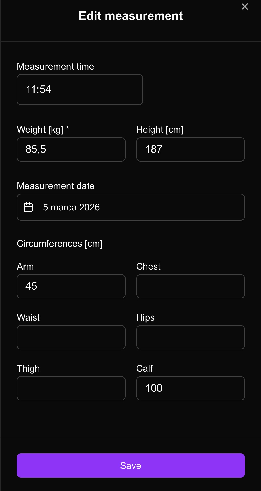
  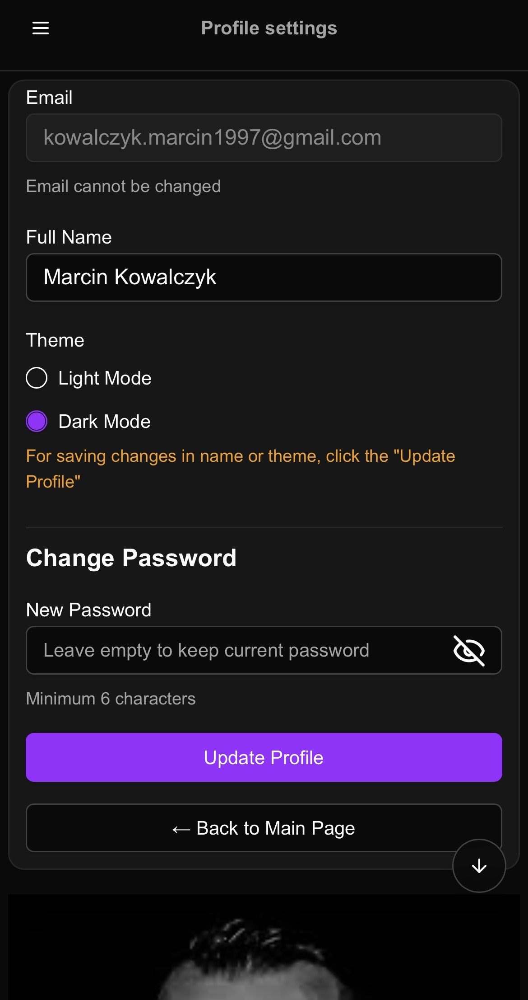
</p>

---

## 📋 Table of contents

- [Training Diet App](#training-diet-app)
  - [📸 Demo](#-demo)
    - [Workout — template \& create \& edit](#workout--template--create--edit)
    - [Diet — add diet day](#diet--add-diet-day)
    - [Screenshots](#screenshots)
  - [📋 Table of contents](#-table-of-contents)
  - [🚀 Getting started](#-getting-started)
    - [Prerequisites](#prerequisites)
    - [Local development](#local-development)
    - [Available commands](#available-commands)
  - [🔍 Overview](#-overview)
  - [🧭 Main user flows](#-main-user-flows)
  - [📐 Specification (behaviour details)](#-specification-behaviour-details)
  - [🧠 Architecture](#-architecture)
  - [🧪 Testing](#-testing)
    - [Unit tests — Vitest + React Testing Library](#unit-tests--vitest--react-testing-library)
    - [E2E tests — Playwright](#e2e-tests--playwright)
  - [⚙️ CI/CD](#️-cicd)
  - [🧩 Tech stack](#-tech-stack)

---

## 🚀 Getting started

### Prerequisites

- Node.js ≥ 20.9.0
- A Supabase project (database + auth configured)

### Local development

```bash
# Install dependencies
npm install

# Copy the environment template and fill in your Supabase credentials
cp .env.example .env.local   # add NEXT_PUBLIC_SUPABASE_URL and NEXT_PUBLIC_SUPABASE_ANON_KEY

# Start the dev server
npm run dev
```

Open [http://localhost:3000](http://localhost:3000).

### Available commands

```bash
npm run dev             # Start development server
npm run build           # Production build
npm run lint            # Run ESLint

# Unit tests
npm run test            # Run all unit tests (Vitest)
npm run test:coverage   # Run unit tests + generate coverage report
npm run test:watch      # Run unit tests in watch mode

# E2E tests (requires a running dev server or uses webServer from Playwright config)
npm run test:e2e        # Run all e2e tests (Playwright, --workers=1)
npm run test:e2e:seq    # Run sequential suite only (e2e/0*.spec.ts)
npm run test:e2e:ui     # Open Playwright UI Mode for sequential suite
```

---

## 🔍 Overview

- **Recommended usage**

  - **Best experience on mobile** (layout and interactions are mobile‑first)
  - The app is designed as a **PWA** – ideally install it to your home screen and use it like a native app

- **Dashboard – Workout history**

  - List of past workouts with date, name and description
  - Date range filters
  - Text search
  - Quick actions: **view**, **edit**, **delete** past workouts

- **Records**

  - Personal bests reps / duration / weights extracted from workouts
  - Quick view of progress for important movements and lifts over time
  - Filters by reps / duration / weight in a side sheet

- **Comparisons**

  - Per‑exercise history with configurable charts (reps, weight, duration)
  - Date filters and visualization to compare sessions across time

- **Workout creation & editing**

  - Step‑by‑step workout form with autosave (draft cached in IndexedDB, with `localStorage` fallback)
  - Create from scratch or reuse structure via **templates**
  - Rich editing: exercise list, sets, reps, weights, notes
  - Compare current exercises with past exercises during workout
  - Protection against losing data when changing tabs during create/editing

- **Templates**

  - Create reusable **workout templates** (name, description, exercises)
  - Browse and search templates
  - View details in a side sheet
  - Edit or delete with confirmation dialogs

- **Exercises**

  - Manage exercise **categories** and **exercises**
  - Search and filtering
  - Quick add / delete, multi‑delete mode with confirmation
  - Designed to be your single source of truth for exercise names

- **Diet & body tracking**

  - **Diet history** — full CRUD for daily nutrition logs: meals grouped by day, each meal containing products with kcal, protein, carbs and fat values; date range filters, inline edit/delete with confirmation; totals (kcal, protein, carbs, fat) computed and displayed per day
  - **Kcal calculator** for estimating daily calorie needs
  - **Body measurements**
    - Quick logging of **weight**, optional **height** and **circumferences** (arm, chest, waist, hips, thigh, calf)
    - History list with **6‑month default date range filters**, **client‑side pagination** and inline edit/delete actions
    - Mobile‑first add/edit sheets with validation and smart defaults (e.g. pre‑filling from the last measurement)

- **Authentication & profile**
  - Email/password sign up & login via Supabase
  - Password reset flow
  - Profile screen to update name, password and **theme (dark/light)**
  - All main routes are protected; anonymous users are redirected to auth

---

## 🧭 Main user flows

- **New user**

  - Registers with email and password
  - Sets basic profile data and preferred theme
  - Defines exercises
  - Creates templates (optional)
  - Creates first workout

- **Typical training day**

  - Opens **Workout history** to see last sessions
  - Creates a new workout (optionally from a template)
  - Uses **Exercises** to keep names consistent
  - Edits a past workout (optional)
  - Logs diet history and checks **Kcal calculator** if needed

- **Progress tracking**

  - Filters **Workout history** by date range
  - Reviews **Records**
  - track your exercises by **Comparisons** with charts
  - Reviews **diet history** and updates **body measurements**

---

## 📐 Specification (behaviour details)

- **Date filters**

  - Workout history and comparisons use a **default date range of the last 6 months** (from today) when the page loads.
  - Date pickers always open on the **currently selected month** (if any), otherwise on the current month.

- **Date display & locale**

  - Dates are formatted using the **user locale (currently Polish)** for both input labels and calendar dropdowns.
  - Date pickers try to show the **full month name** in the input if there is enough horizontal space; if not, they automatically switch to the **short, 3‑letter month name**.

- **Charts & comparisons**

  - On mobile, rotating the device to **landscape** in the Comparisons view automatically shows the exercise history chart in a **fullscreen overlay** for better readability.
  - The comparisons chart is configurable per exercise (mode, reps/weight/duration). If the chosen configuration yields no matching sets for the selected exercise, the app shows a **non-blocking warning toast** instead of an empty chart.
  - Records and comparisons both derive values based on the **appropriate metric for a given exercise type** (e.g. reps, weight, duration), so PRs and history are comparable within the same exercise category.

- **Pagination**

  - Workout history and comparisons use a **shared, generic pagination component** based on shadcn/ui `Pagination` and `Field`, with a compact, mobile‑friendly layout (rows‑per‑page select + page numbers + arrow icons).
  - Pagination is currently **handled on the client**: the backend returns all results for the selected date range, and the `PaginatedSection` component slices the list into pages and controls which slice is visible.
  - By default only **neighboring page numbers plus the first and last page** are shown (pattern like `1 … 3 4 5 … N`), while simpler cases (≤ 5 pages) render all page numbers without ellipses.
  - On small screens the pagination bar is very compact: **icon‑only arrows (no "Previous/Next" labels), small page chips**, all wrapped in a bordered container aligned to the **right edge** of the list.

- **Safety & UX**

  - Destructive actions (like deleting workouts, templates or exercises) always require **explicit confirmation in a modal**.
  - The workout form uses **autosave to `localStorage`** to protect against accidental data loss when navigating away or switching tabs.
  - When you try to leave a screen with **unsaved changes**, the app shows a **confirm modal** to prevent accidental loss of edits.
  - Primary action buttons in forms (save/update) become **enabled only when there are actual changes**, and are hidden/disabled or visually de‑emphasised when the current state matches the persisted data.
  - Single global scroll helper button visible after first scroll, allowing quick jump to the top or bottom of the page.

---

## 🧠 Architecture

- **Frontend**

  - **Next.js 16 App Router** with two route groups:
    - `app/(auth)/` — public auth pages (login, register, password reset)
    - `app/(protected)/` — all main pages, guarded by Supabase session check
  - Client components where needed (forms, sheets, search, react-query hooks)
  - **TanStack Query** for all server data: caching, refetching, optimistic UX

- **API layer**

  - Lives in `app/api/` as Next.js Route Handlers (not Server Actions)
  - Every handler: creates a Supabase server client → verifies user via `getUser()` → queries with RLS

- **Backend / data**

  - **Supabase** PostgreSQL as data store
  - Supabase Auth for sessions; Row Level Security keeps each user's data isolated
  - All CRUD operations go through typed API route handlers and TanStack Query hooks

- **Component structure**

  - `components/<feature>/` contains UI components, `hooks/` for local state, `api/` for TanStack Query hooks
  - Shared primitives (date picker, pagination, confirm modal, search input, scroll button) in `components/shared/`
  - shadcn/ui primitives in `components/ui/`

- **Form autosave**
  - Workout create/edit uses IndexedDB (with localStorage fallback) via `lib/form-cache.ts`

---

## 🧪 Testing

### Unit tests — Vitest + React Testing Library

**365+ tests, ~90% coverage** across helpers, hooks, and components.

```bash
npm run test            # run once
npm run test:watch      # watch mode
npm run test:coverage   # coverage report (terminal table + HTML in coverage/)
```

**What is covered:**
- Pure helper functions (`lib/crypto.ts`, records/body-measurements/diet helpers)
- Search/filter hooks (`useWorkoutHistorySearch`, `useTemplateSearch`, etc.)
- TanStack Query hooks with MSW mocks (body-measurements, exercises, workout-template, workout-form, diet APIs)
- Components with logic (`PaginatedSection`, `AddMeasurementSheet`, `Exercises`)
- Auth hooks (login, register, forgot/reset password, logout)
- CRUD hooks for exercises, workout templates, workouts
- Profile hook (`useUpdateProfile`)

**Key patterns:**
- Test files live next to source: `lib/foo.test.ts`, `components/bar/bar.test.tsx`
- TanStack Query hooks: `renderHook` + `createQueryWrapper()` from `tests/test-utils.tsx`, MSW via `tests/msw-server.ts`
- Component tests mock hooks via `vi.mock()` (not MSW)

### E2E tests — Playwright

End-to-end tests run against a real Supabase environment. Credentials come from `.env.local` (`E2E_EMAIL`, `E2E_PASSWORD`).

```bash
npm run test:e2e        # all tests, sequential (--workers=1)
npm run test:e2e:seq    # sequential suite only (e2e/0*.spec.ts)
npm run test:e2e:ui     # Playwright UI Mode for sequential suite
```

**Two test groups:**

| Group | Files | Description |
|-------|-------|-------------|
| Sequential suite | `e2e/0*.spec.ts` (01–08) | Tests depend on each other; share a fixed `RUN_ID`; must run in order |
| Independent tests | `e2e/1*.spec.ts` (10–17) | Each test is fully self-contained; cleans up its own data |

**Sequential suite flow (01 → 08):**
1. `01` — create exercise category + exercises
2. `02` — create workout template
3. `03` — create Workout A from template
4. `04` — edit Workout A sets
5. `05` — create Workout B
6. `06` — verify records page
7. `07` — verify comparisons page
8. `08` — cleanup all test data via API

**Independent tests (10–17):**
- `10` — auth (login/logout)
- `11` — body measurements (create + cleanup)
- `12` — workout create (create + cleanup)
- `13` — create workout from template (read-only)
- `14` — workout edit (create dedicated workout → edit → cleanup)
- `15` — unsaved changes guard (no data created)
- `16` — workout template create + edit
- `17` — diet history (add, edit, delete)

---

## ⚙️ CI/CD

- **Platform:** [Vercel](https://vercel.com)
- **Trigger:** every push to `main` → automatic production deployment
- No manual deployment steps needed
- Environment variables (Supabase credentials) are configured in the Vercel project settings

**Tests during deployment:**
- ✅ **Unit tests** (`npm run test`) run automatically as part of the Vercel build — a failing test blocks the deployment
- ❌ **E2E tests** are not run during deployment (they require a running server and real Supabase credentials); run them locally before pushing

---

## 🧩 Tech stack

| Category | Technology |
|----------|------------|
| Framework | [Next.js 16](https://nextjs.org/) — App Router, RSC, Route Handlers |
| UI | [React 19](https://react.dev/) + [TypeScript](https://www.typescriptlang.org/) |
| Styling | [Tailwind CSS v4](https://tailwindcss.com/) + [shadcn/ui](https://ui.shadcn.com/) |
| Data fetching | [TanStack Query v5](https://tanstack.com/query/latest) |
| Backend | [Supabase](https://supabase.com/) — PostgreSQL, Auth, RLS |
| Charts | [Recharts](https://recharts.org/) |
| Themes | [next-themes](https://github.com/pacocoursey/next-themes) |
| Unit tests | [Vitest](https://vitest.dev/) + [React Testing Library](https://testing-library.com/) + [MSW](https://mswjs.io/) |
| E2E tests | [Playwright](https://playwright.dev/) |
| Deployment | [Vercel](https://vercel.com) |
